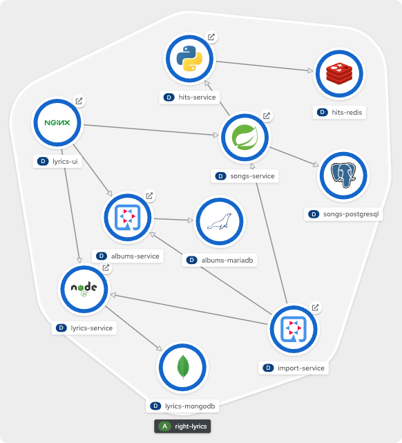

# Right Lyrics

A very simple microservice architecture to be deployed in OpenShift.

## Usage

* [Build and deploy in Minikube with Tekton Pipelines](./documentation/pipelines/minikube/README.md)
* [Build and deploy in OpenShift with OpenShift Pipelines](./documentation/pipelines/openshift/README.md)
* [Deploy in OpenShift with Operators](./documentation/openshift/operators/README.md)

## Overview

## Topology

## Components

* **Lyrics UI** (React.js + NGINX)
* **Lyrics Service** (Node.js + MongoDB)
* **Songs Service** (Spring Boot + PostgreSQL)
* **Hits Service** (Python + Redis)
* **Albums Service** (Quarkus + MariaDB)
* **Import Service** (Quarkus)