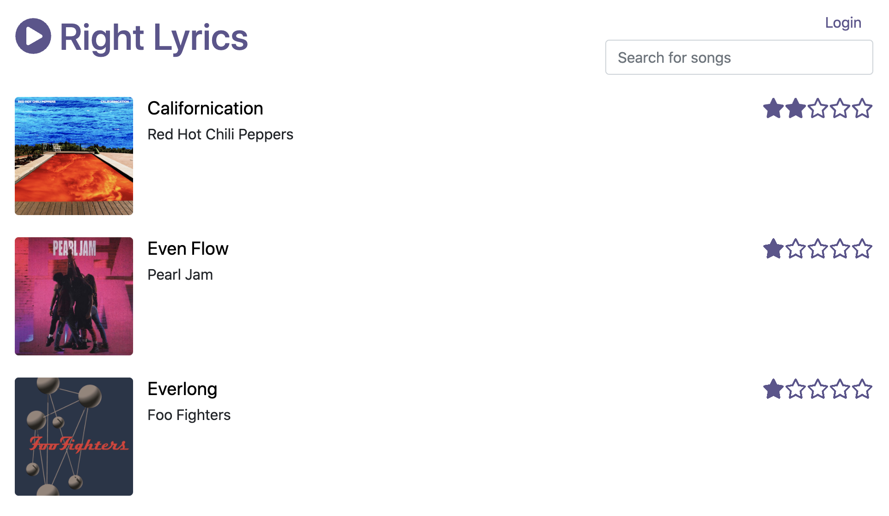

# Right Lyrics

A very simple microservice architecture to deploy in OpenShift.

## Deploy in OpenShift

The fastest way to deploy Right Lyrics is with the operator, follow [this instructions](./documentation/operator/README.md) to install it.

With the operator running, create the following custom resource (in the same namespace where the operator is running):

```yaml
apiVersion: veicot.io/v1
kind: RightLyrics
metadata:
  name: right-lyrics
```

```bash
oc apply -f https://raw.githubusercontent.com/leandroberetta/right-lyrics/master/operator/deploy/crds/veicot.io_v1_rightlyrics_cr.yaml -n right-lyrics
```

After a few minutes, the application will be available and ready to use using the following link:

```bash
echo "http://$(oc get route lyrics-ui -o jsonpath='{.spec.host}' -n right-lyrics)"
```

## Overview



## Components

* **Lyrics Page** (React.js + Node.js)
* **Lyrics Service** (Node.js + MongoDB)
* **Songs Service** (Spring Boot + PostgreSQL)
* **Hits Service** (Python + Redis)
* **Albums Service** (Quarkus + MariaDB)
* **Import Service** (Quarkus)
* **Operator** (Ansible)
* **Authentication** (Keycloak)

## Extras

* [Deploy in Minikube (DEV) with Tekton Pipelines](./documentation/pipelines/minikube/README.md)
* [Deploy in OpenShift (PROD) with OpenShift Pipelines](./documentation/pipelines/openshift/README.md)


