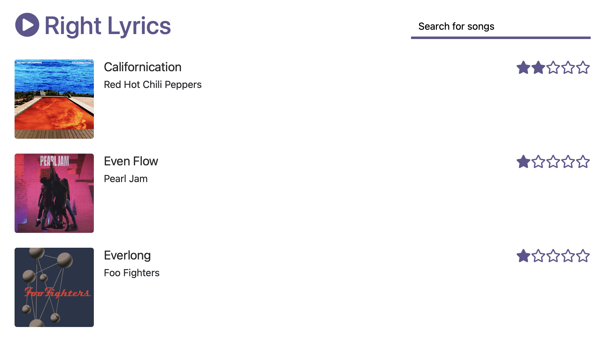

# Right Lyrics

A very simple microservice architecture to deploy in OpenShift.

## Usage

The fastest way to deploy Right Lyrics is with a Helm chart:

```bash
kubectl create namespace right-lyrics

helm install my-rl ./helm-chart --set wildcardDomain=right.ly
```

NOTE: Set the wildcardDomain variable accordingly.

As part of the output you will see:

```
Thank you for installing right-lyrics.

Visit the application at:

http://my-rl-lyrics-page-right-lyrics.right.ly
```

## Overview



## Components

* **Lyrics Page** (React.js)
* **Lyrics Service** (Express.js + MongoDB)
* **Songs Service** (Spring Boot + PostgreSQL)
* **Hits Service** (Python + Redis)
* **Albums Service** (Quarkus + MariaDB)