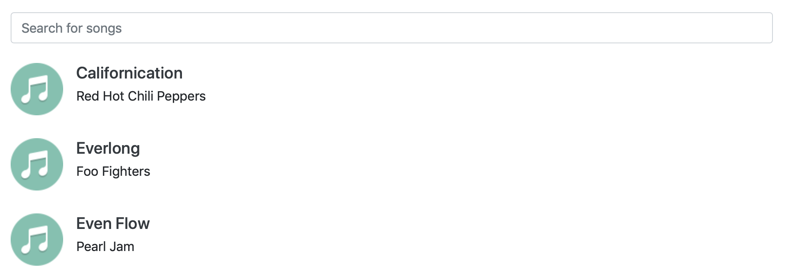
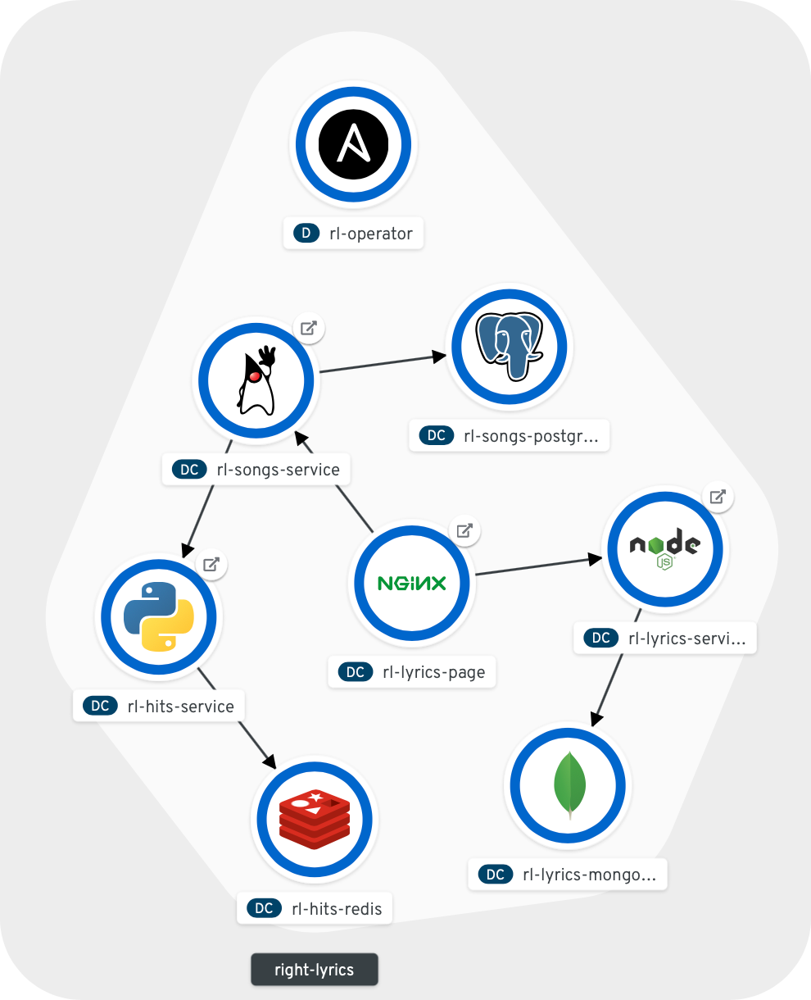

# Right Lyrics

A very simple microservice architecture to be deployed in OpenShift with Ansible Operators.

## Overview



## Components

* Lyrics Page (React.js)
* Lyrics Service (Node.js + MongoDB)
* Songs Service (Spring Boot + PostgreSQL)
* Hits Service (Python + Redis)
* Operator (Ansible)

## Deploy in OpenShift

Create the Right Lyrics project:

```bash
oc new-project right-lyrics
```

Create the CRD that will be watched by the Operator:

```bash
oc create -f ./operator/deploy/crds/veicot_v1_rightlyrics_crd.yaml
```

Deploy the Operator:

```bash
oc create -f ./operator/deploy/service_account.yaml
oc create -f ./operator/deploy/role.yaml
oc create -f ./operator/deploy/role_binding.yaml
oc create -f ./operator/deploy/operator.yaml
```

Deploy a CR representing the application:

```yaml
apiVersion: veicot.io/v1
kind: RightLyrics
metadata:
  name: my-rightlyrics
spec:
  routesBaseDomain: apps-crc.testing
  lyricsPageReplicas: 1
  lyricsServiceReplicas: 1
  songsServiceReplicas: 1
  hitsServiceReplicas: 1
```

The CR can be created as follows:

```bash
oc create -f ./operator/deploy/crds/veicot_v1_rightlyrics_cr.yaml
```

Finally the Operator watches this CR an creates the application.

## Topology


