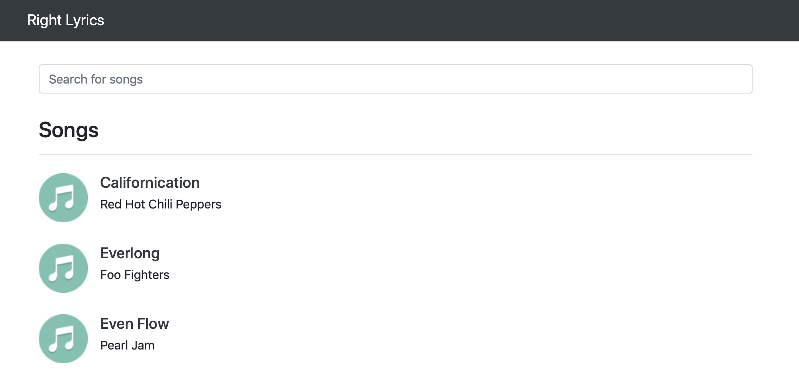
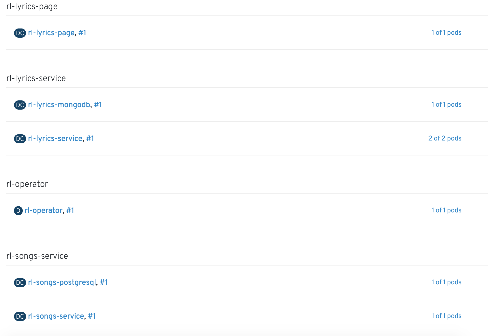

# Right Lyrics

A very simple microservice architecture to be deployed in OpenShift with Ansible Operators.

## Components

* Lyrics Page (React.js)
* Lyrics Service (Node.js + MongoDB)
* Songs Service (Spring Boot + PostgreSQL)

## Deploy in OpenShift

### Overview

### Operator

    oc new-project right-lyrics

    oc create -f ./openshift/operator/deploy/crds/veicot_v1_rightlyrics_crd.yaml
    oc create -f ./openshift/operator/deploy/service_account.yaml
    oc create -f ./openshift/operator/deploy/role.yaml
    oc create -f ./openshift/operator/deploy/role_binding.yaml
    oc create -f ./openshift/operator/deploy/operator.yaml
    
    echo "apiVersion: veicot.io/v1
    kind: RightLyrics
    metadata:
      name: my-rightlyrics
    spec:
      routePostfix: apps-crc.testing
      lyricsServiceReplicas: 1
      songsServiceReplicas: 1" | oc create -f -

### Template

    oc new-project right-lyrics

    oc create -f ./openshift/template/template.yaml -n right-lyrics

    oc new-app --template=right-lyrics -n right-lyrics

### CLI

    oc new-project right-lyrics

    oc create configmap rl-lyrics-mongodb-data --from-file=lyrics.json=./data/lyrics.json -n right-lyrics

    oc new-app --name=rl-lyrics-mongodb -n right-lyrics \
        -l app=rl-lyrics-service \
        --template mongodb-ephemeral \
        -p MONGODB_DATABASE=rl-lyrics-mongodb \
        -p MONGODB_VERSION=3.6 \
        -p MONGODB_USER=right-lyrics \
        -p MONGODB_PASSWORD=right-lyrics \
        -p DATABASE_SERVICE_NAME=rl-lyrics-mongodb

    oc patch dc/rl-lyrics-mongodb -p '{"spec":{"strategy":{"recreateParams":{"post":{"execNewPod":{"command":["/bin/sh","-i","-c","mongoimport --collection=lyrics --username=right-lyrics --password=right-lyrics --db=rl-lyrics-mongodb --file=/tmp/data/lyrics.json --host=rl-lyrics-mongodb:27017"],"containerName":"mongodb","volumes":["rl-lyrics-mongodb-data"]},"failurePolicy":"Abort"}},"type":"Recreate"}}}' -n right-lyrics

    oc set volume dc/rl-lyrics-mongodb --add --name=rl-lyrics-mongodb-data -t configmap --configmap-name=rl-lyrics-mongodb-data --mount-path=/tmp/data --overwrite -n right-lyrics

    oc new-app --name=rl-lyrics-service -n right-lyrics \
        -i nodejs:8 \
        --code=https://github.com/leandroberetta/right-lyrics.git \
        --context-dir=lyrics-service \
        -e DB_USERNAME=right-lyrics \
        -e DB_PASSWORD=right-lyrics \
        -e DB_NAME=rl-lyrics-mongodb \
        -e DB_HOST=rl-lyrics-mongodb

    oc expose svc rl-lyrics-service -n right-lyrics

    oc create configmap rl-songs-postgresql-data --from-file=songs.sql=./data/songs.sql -n right-lyrics

    oc new-app --name=rl-songs-postgresql -n right-lyrics \
        -l app=rl-songs-service \
        --template postgresql-ephemeral \
        -p POSTGRESQL_DATABASE=rl-songs-postgresql\
        -p POSTGRESQL_VERSION=10 \
        -p POSTGRESQL_USER=right-lyrics \
        -p POSTGRESQL_PASSWORD=right-lyrics \
        -p DATABASE_SERVICE_NAME=rl-songs-postgresql 

    oc patch dc/rl-songs-postgresql -p '{"spec":{"strategy":{"recreateParams":{"post":{"execNewPod":{"command":["/bin/sh","-i","-c","PGPASSWORD=right-lyrics psql -U right-lyrics -h rl-songs-postgresql -d rl-songs-postgresql -f /tmp/data/songs.sql"],"containerName":"postgresql","volumes":["rl-songs-postgresql-data"]},"failurePolicy":"Abort"}},"type":"Recreate"}}}' -n right-lyrics

    oc set volume dc/rl-songs-postgresql --add --name=rl-songs-postgresql-data -t configmap --configmap-name=rl-songs-postgresql-data --mount-path=/tmp/data --overwrite -n right-lyrics

    oc new-app --name=rl-songs-service -n right-lyrics \
        -i redhat-openjdk18-openshift:1.5 \
        --code=https://github.com/leandroberetta/right-lyrics.git \
        --context-dir=songs-service \
        -e SPRING_DATASOURCE_URL=jdbc:postgresql://rl-songs-postgresql:5432/rl-songs-postgresql \
        -e SPRING_DATASOURCE_USERNAME=right-lyrics \
        -e SPRING_DATASOURCE_PASSWORD=right-lyrics 

    oc expose svc rl-songs-service -n right-lyrics

    oc new-build --name rl-lyrics-page-builder -n right-lyrics \
        --code=https://github.com/leandroberetta/right-lyrics.git \
        --context-dir=lyrics-page \
        -i nodejs:10 \
        --strategy=docker

    oc new-build -i nginx:1.12 --name=rl-lyrics-page -n right-lyrics \
        --source-image=rl-lyrics-page-builder:latest \
        --source-image-path=/opt/app-root/src/build/.:. \
        --allow-missing-imagestream-tags

    export RL_SONGS_ROUTE=$(oc get route rl-songs-service --template={{.spec.host}})
    sed -i "" "s/RL_SONGS_ROUTE/$RL_SONGS_ROUTE/g" ../lyrics-page/public/config.js

    export RL_LYRICS_ROUTE=$(oc get route rl-lyrics-service --template={{.spec.host}})
    sed -i "" "s/RL_LYRICS_ROUTE/$RL_LYRICS_ROUTE/g" ../lyrics-page/public/config.js

    oc create configmap rl-lyrics-page --from-file=./data/config.js -n right-lyrics

    oc new-app rl-lyrics-page:latest --name=rl-lyrics-page --allow-missing-imagestream-tags -n right-lyrics

    oc set volume dc/rl-lyrics-page --add --name=rl-lyrics-page -t configmap --configmap-name=rl-lyrics-page --mount-path=/opt/app-root/src/config.js --sub-path=config.js --overwrite -n right-lyrics

    oc expose dc rl-lyrics-page --port=8080 -n right-lyrics

    oc expose svc rl-lyrics-page -n right-lyrics