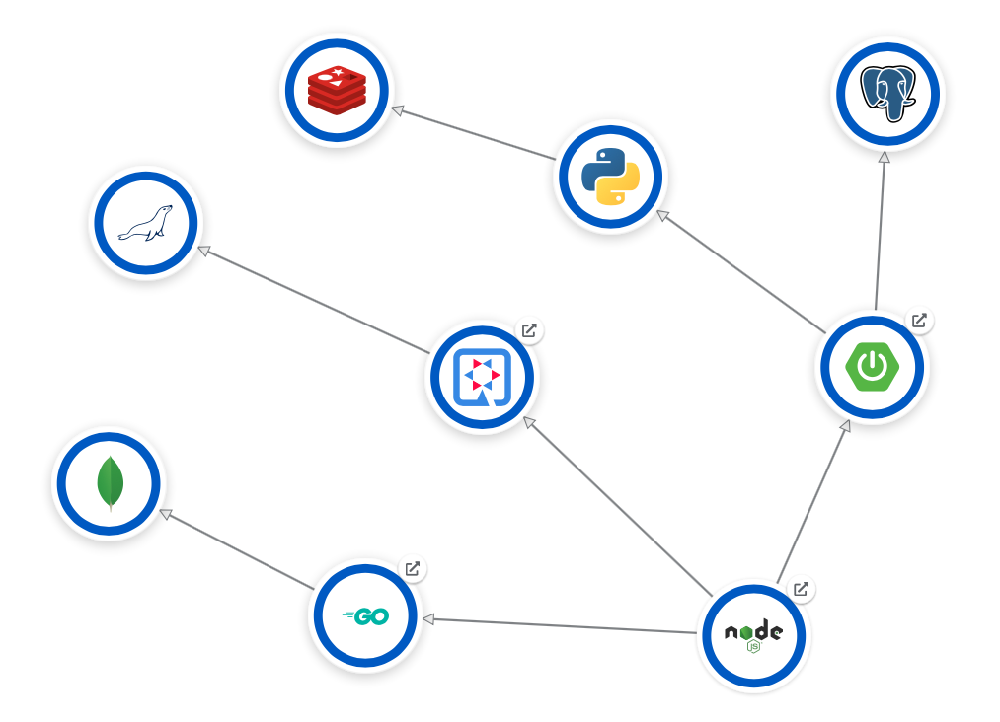

# Right Lyrics

A very simple microservice architecture to deploy in OpenShift (or any Kubernetes).

## Overview


## Components



## Deployment

The fastest way to deploy Right Lyrics is with a Helm chart:

```bash
kubectl create namespace right-lyrics

helm install rl ./helm-chart --wait --set wildcardDomain=veicot.io -n right-lyrics
```

**NOTE**: Set the wildcardDomain variable accordingly.

As a result, you'll see the following output:

```
Thanks for installing Right Lyrics.

  ____  _       _     _     _               _
 |  _ \(_) __ _| |__ | |_  | |   _   _ _ __(_) ___ ___
 | |_) | |/ _` | '_ \| __| | |  | | | | '__| |/ __/ __|
 |  _ <| | (_| | | | | |_  | |__| |_| | |  | | (__\__ \
 |_| \_\_|\__, |_| |_|\__| |_____\__, |_|  |_|\___|___/
          |___/                  |___/

Visit the application at:

http://rl.veicot.io
```
