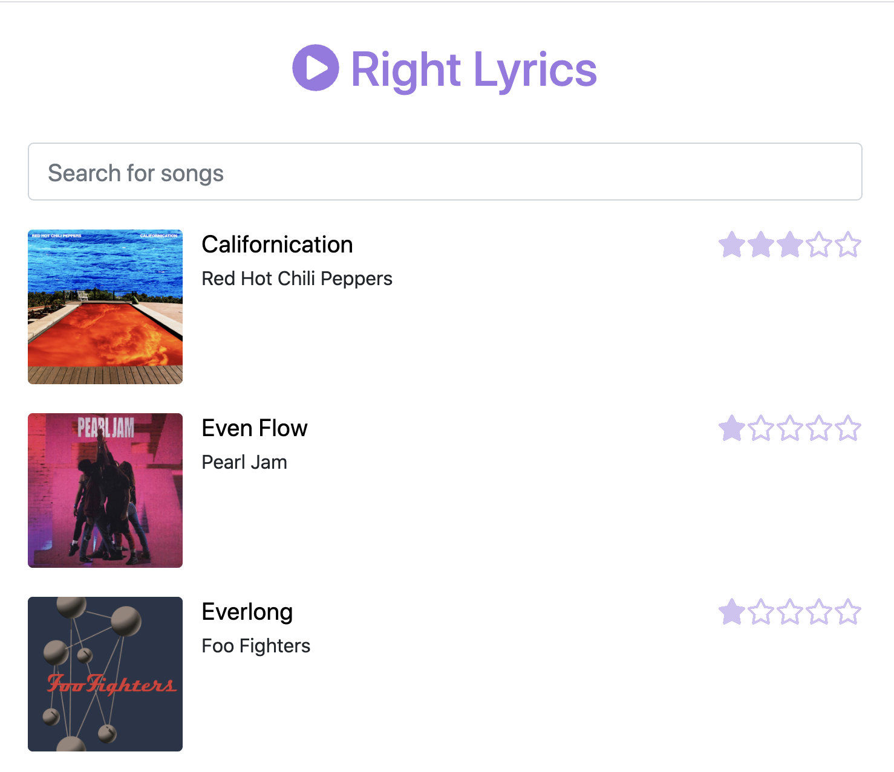

# Right Lyrics

A very simple microservice architecture to be deployed in OpenShift.

## Overview

## Documentation

* [Build and deploy in Minikube with Tekton pipelines](./documentation/minikube/README.md)
* Build and deploy in OpenShift with Tekton pipelines
* [Deploy in OpenShift with a Kubernetes Operator](./documentation/openshift/operator/README.md)

## Components

* **Lyrics Page** (React.js + NGINX)
* **Lyrics Service** (Node.js + MongoDB)
* **Songs Service** (Spring Boot + PostgreSQL)
* **Hits Service** (Python + Redis)
* **Albums Service** (Quarkus + MySQL)
* **Operator** (Operator Framework using Ansible)
* **Importer** (Quarkus)
* **Admin Page** (React.js + NGINX)