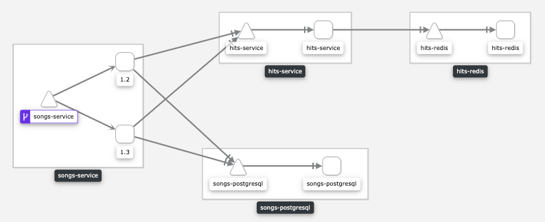

# Deploy a Canary version with Service Mesh

Canary deployments can be managed with OpenShift Service Mesh (Istio).

### Overview

The new version of Songs adds a YouTube preview to show in the Lyrics Page.

So as a result of doing a Canary deployment, sometimes the YouTube preview will appear and sometimes it won't.

This situation can be seen in Kiali too:

### Prerequisites

* OpenShift (4.2 or higher)
* OpenShift Pipelines
* OpenShift Service Mesh
* Tekton CLI (tkn)

### Usage

